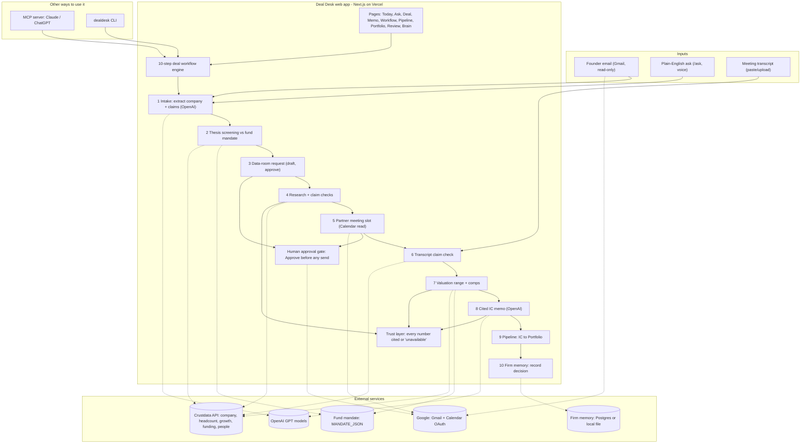

# Deal Desk - detailed system diagram

```mermaid
flowchart TB
  subgraph IN["Inputs"]
    E["Founder email (Gmail, read-only)"]
    Q["Plain-English ask (/ask, voice)"]
    T["Meeting transcript (paste/upload)"]
  end

  subgraph APP["Deal Desk web app - Next.js on Vercel"]
    UI["Pages: Today, Ask, Deal, Memo, Workflow, Pipeline, Portfolio, Review, Brain"]
    WF["10-step deal workflow engine"]
    S1["1 Intake: extract company + claims (OpenAI)"]
    S2["2 Thesis screening vs fund mandate"]
    S3["3 Data-room request (draft, approve)"]
    S4["4 Research + claim checks"]
    S5["5 Partner meeting slot (Calendar read)"]
    S6["6 Transcript claim check"]
    S7["7 Valuation range + comps"]
    S8["8 Cited IC memo (OpenAI)"]
    S9["9 Pipeline: IC to Portfolio"]
    S10["10 Firm memory: record decision"]
    TR["Trust layer: every number cited or 'unavailable'"]
    AP["Human approval gate: Approve before any send"]
  end

  subgraph EXT["External services"]
    CD[("Crustdata API: company, headcount, growth, funding, people")]
    OA[("OpenAI GPT models")]
    G[("Google: Gmail + Calendar OAuth")]
    MJ[("Fund mandate: MANDATE_JSON")]
    DB[("Firm memory: Postgres or local file")]
  end

  subgraph MODES["Other ways to use it"]
    MCP["MCP server: Claude / ChatGPT"]
    CLI["dealdesk CLI"]
  end

  E --> S1
  Q --> S1
  T --> S6
  UI --> WF
  WF --> S1 --> S2 --> S3 --> S4 --> S5 --> S6 --> S7 --> S8 --> S9 --> S10
  S1 -.-> OA
  S8 -.-> OA
  S2 -.-> MJ
  S7 -.-> MJ
  S2 -.-> CD
  S4 -.-> CD
  S6 -.-> CD
  S7 -.-> CD
  S3 --> AP
  S5 --> AP
  AP -.-> G
  S5 -.-> G
  E -.-> G
  S10 -.-> DB
  S4 --> TR
  S7 --> TR
  S8 --> TR
  MCP --> WF
  CLI --> WF
```
