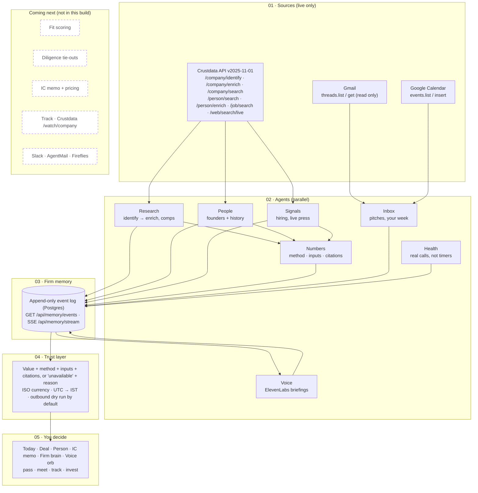

# Deal Desk — architecture (for the README)

```mermaid
flowchart TB
  subgraph S["01 · Sources (live only)"]
    CD["Crustdata API v2025-11-01<br/>/company/identify · /company/enrich · /company/search<br/>/person/search · /person/enrich · /job/search · /web/search/live"]
    GM["Gmail<br/>threads.list / get (read only)"]
    GC["Google Calendar<br/>events.list / insert"]
  end
  subgraph A["02 · Agents (parallel)"]
    R["Research<br/>identify → enrich, comps"]
    P["People<br/>founders + history"]
    SG["Signals<br/>hiring, live press"]
    N["Numbers<br/>method · inputs · citations"]
    I["Inbox<br/>pitches, your week"]
    V["Voice<br/>ElevenLabs briefings"]
    H["Health<br/>real calls, not timers"]
  end
  subgraph M["03 · Firm memory"]
    MEM[("Append-only event log (Postgres)<br/>GET /api/memory/events · SSE /api/memory/stream")]
  end
  subgraph T["04 · Trust layer"]
    TR["Value + method + inputs + citations, or 'unavailable' + reason<br/>ISO currency · UTC → IST · outbound dry run by default"]
  end
  subgraph Y["05 · You decide"]
    U["Today · Deal · Person · IC memo · Firm brain · Voice orb<br/>pass · meet · track · invest"]
  end
  subgraph NX["Coming next (not in this build)"]
    F["Fit scoring"]:::next
    D["Diligence tie-outs"]:::next
    IC["IC memo + pricing"]:::next
    TK["Track · Crustdata /watch/company"]:::next
    OB["Slack · AgentMail · Fireflies"]:::next
  end
  CD --> R & P & SG
  GM --> I
  GC --> I
  R & P & SG --> N
  R & P & SG & N & I & V & H --> MEM
  MEM --> V
  MEM --> TR --> U
  classDef next stroke-dasharray: 5 5,fill:#fff,color:#52525b
```
